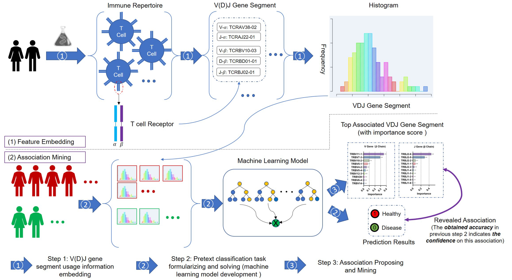

# VDJMiner
An interpretable artificial intelligence model to predict the diseases, as well as prognosis and treatment response.

# The schema of the developed machine-learning-based VDJMiner



## Requirements
- xgboost==1.5.2
- scikit-learn==1.1.0
- pandas==1.4.2
- numpy==1.22.3
- pyerf==1.0.1


## Data availability
The raw data and relative information are given at `RawData` folder. The preprocessed data are given in the folder `Data`, where the data for a specific task are stored in a python pickle file named with the task name.


## Guideline for utilizing:
```bash
# Step1. clone the project
git clone https://github.com/TencentAILabHealthcare/VDJMiner
# Step2. change directory to project
cd VDJMiner
# Step3. run VDJMiner
python vdj_miner.py --target=TARGET --result_dir=Result_DIR
```
- target: target disease
- result_dir: directory stores results, default: ./results

## example
You can set the target value as one of [Asthma|AutoImmune Disease|Cancer|Chronic Kidney Disease|Congestive Heart Failure|Copd|Coronary Artery Disease|Diabetes|Hospitalized Covid-19].

```bash
python vdj_miner.py --target='Cancer' --result_dir='./results'
```

The result is saved in `./results` folder, the contents are as follows.
```bash
------------------------------------------------------------------
                     Value        Lower Limit     Upper Limit     
------------------------------------------------------------------
AUC      :           0.904           0.787           0.968        
Accuracy :           0.905           0.794           0.952        
F1-Score :           0.915           0.829           0.956        
------------------------------------------------------------------
```
